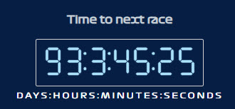
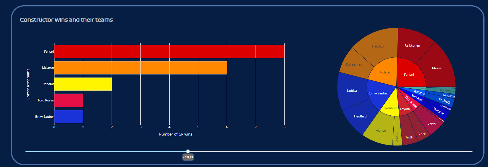
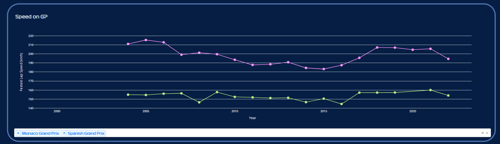

 

# F1 statistic dashboard (seasons 2000-2021)

Interactive dashboard created with Python, Dash-Plotly, Pandas and Numpy.

## Table of Contents
* [General info](#general-info)
* [Technologies](#technologies)
* [Setup](#setup)

## General info
Dashboad created in educational purposes. It's main goal is to count down time to the next race, visualize results, speed, teams structures in seasons 2000 - 2021.  
Dataset used in project came from [Kaggle](kaggle.com) service and was shared by user [Vopani](https://www.kaggle.com/rohanrao) based on CC0: Public Domain. 
[F1-World-Championship ](https://www.kaggle.com/datasets/rohanrao/formula-1-world-championship-1950-2020)
  
 
  
 
  
## Technologies
    * Python 3.10.8
    * Dash 2.6.1
    * Flask 2.2.2
    * Plotly 5.10.0
## Setup
Dashboard has been deployed on Heroku service and you can find it [here](https://stats-f1-app.herokuapp.com/).
